# Content Intelligence Pipeline

An end-to-end data platform that ingests podcast/feed metadata from public
sources, enriches it with an LLM (categorization, entity extraction, data
quality scoring), and transforms it through a Bronze → Silver → Gold
pipeline into analytics-ready tables, surfaced on a live dashboard.

This isn't a CRUD app. It mirrors real content/media data operations work:
ingesting messy semi-structured feed data, validating and normalizing it,
and turning it into structured metrics a business can act on, with an LLM
doing the categorization and quality-scoring work that would otherwise be
manual.

## Live dashboard

Built with Streamlit + Plotly, reading directly from the dbt Gold layer.
Refreshes automatically as new data flows through the pipeline.

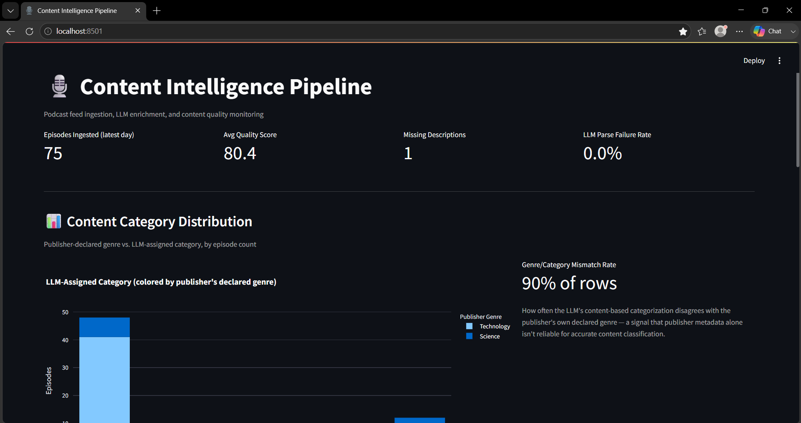
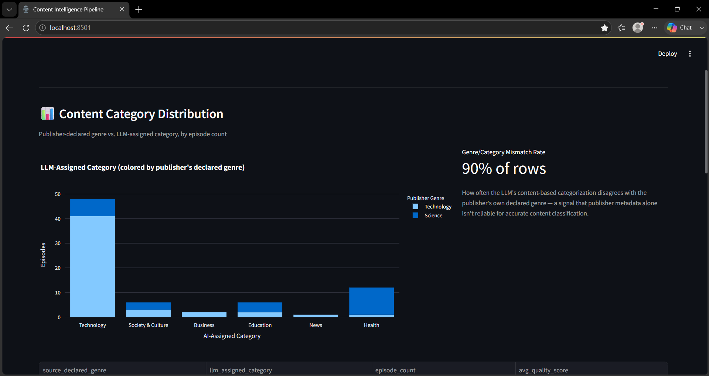
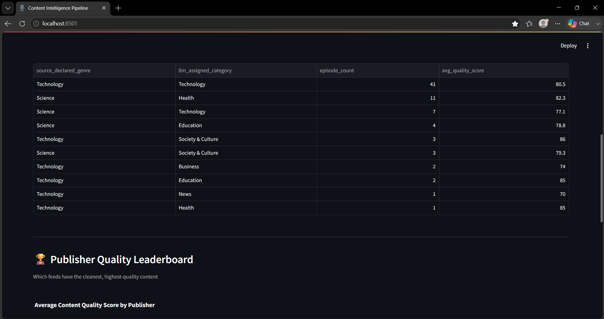
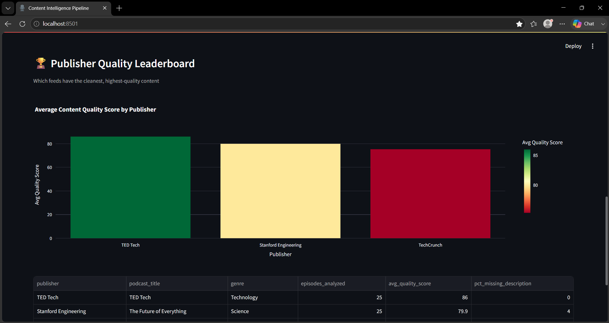
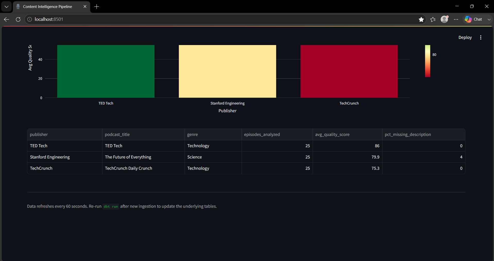

## Key finding: publisher genres don't reliably reflect actual content

The most interesting result from this pipeline wasn't a metric. It was a
mismatch. Every episode from podcasts that publishers themselves labeled
**"Science"** on iTunes got re-categorized by the LLM into something else
entirely: Health, Technology, Education, or Society & Culture. Not a single
one matched "Science."

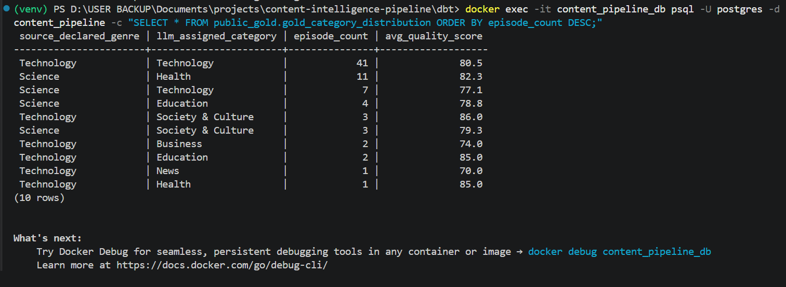

This shows that publisher-declared genre tags are too broad or inconsistent
to rely on for accurate content classification, and that reading actual
episode content (which the LLM enrichment step does) surfaces a materially
more accurate picture. This has direct implications for content search,
recommendation, and catalog organization.

## How the AI enrichment works

Each episode's raw title and description gets sent to an LLM (running on
Groq, using an OpenAI-compatible interface), which returns structured JSON:
category, key entities mentioned, data quality flags, and a 0–100 quality
score with a one-line justification.

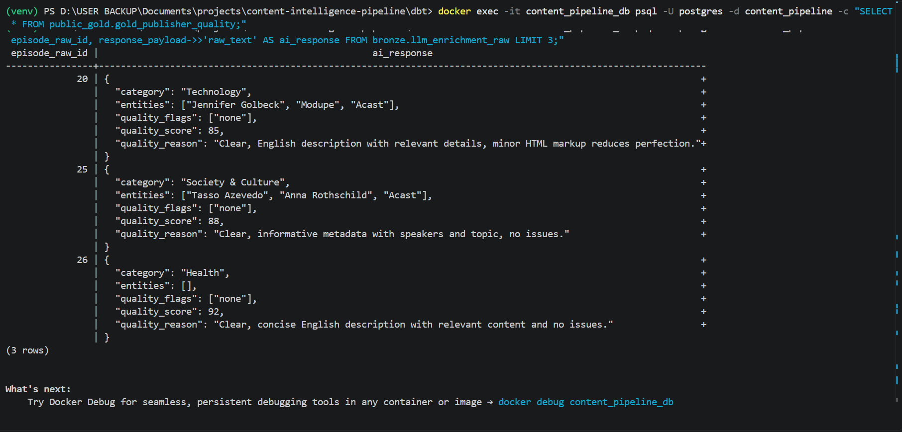

## Publisher quality leaderboard

Aggregating LLM quality scores by publisher surfaces exactly the kind of
"which feeds need attention" signal a real feed/content operations team
would use, directly analogous to feed health monitoring work.

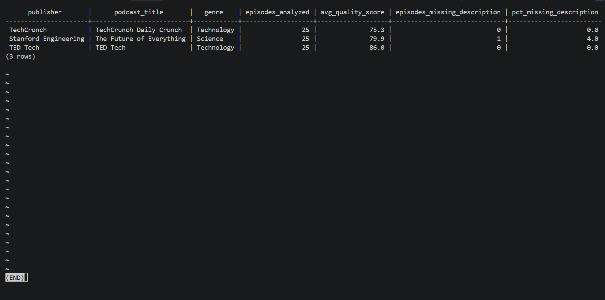

## Data quality is tested, not assumed

Every Silver-layer table has dbt tests enforcing uniqueness, non-null
constraints, and valid value ranges (e.g. quality scores must fall between
0–100). All 9 tests pass on the current dataset.

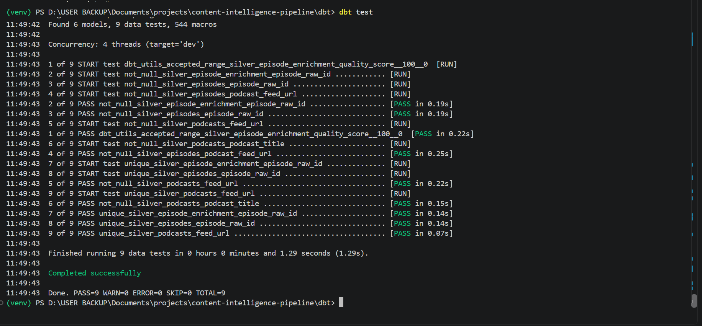

## Orchestrated with Apache Airflow

The full pipeline (ingest, enrich, dbt Silver, dbt Gold, dbt test)
runs as a single Airflow DAG, containerized with a dedicated Postgres
metadata database (rather than SQLite) so the scheduler and webserver can
run concurrently without the locking issues SQLite hits under real load.
Every task completes successfully end-to-end.

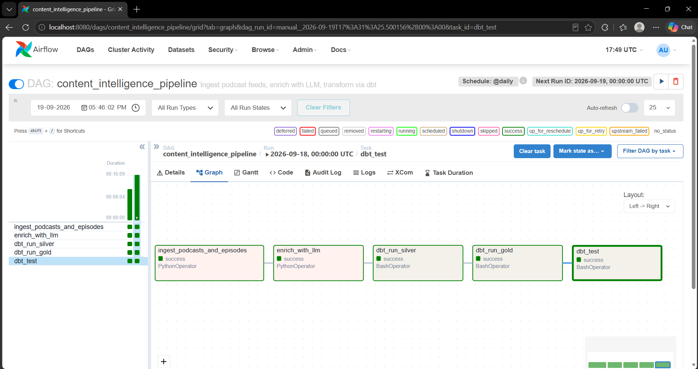

## Architecture

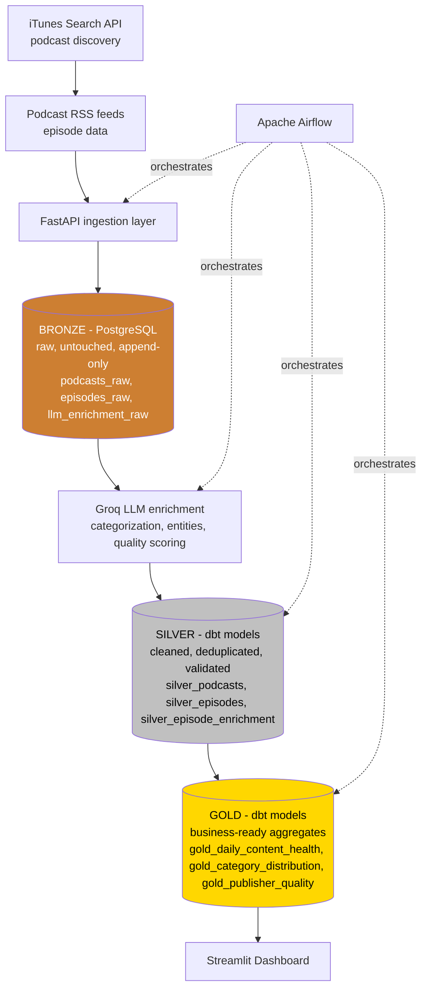

## Tech stack

| Layer          | Tech                                    |
|----------------|-------------------------------------------|
| Ingestion      | Python, FastAPI, `requests`, `feedparser`  |
| Storage        | PostgreSQL (Bronze/Silver/Gold schemas)    |
| Transformation | dbt (with dbt tests for data quality)      |
| Orchestration  | Apache Airflow (DAG defined, see `airflow/`)|
| AI             | Groq API (OpenAI-compatible interface)     |
| Dashboard      | Streamlit + Plotly                          |
| Infra          | Docker, Docker Compose                      |

## Repo structure

```
content-intelligence-pipeline/
├── backend/              # FastAPI app: ingestion + LLM enrichment
│   └── app/
│       ├── config.py
│       ├── db.py
│       ├── ingest.py     # iTunes API + RSS feed ingestion (Bronze)
│       ├── llm_enrich.py # LLM categorization/quality scoring (Bronze)
│       └── main.py       # FastAPI endpoints
├── sql/                  # Bronze schema DDL
├── dbt/
│   ├── models/
│   │   ├── silver/       # cleaning, dedup, normalization + tests
│   │   └── gold/         # business-ready aggregates
│   └── dbt_project.yml
├── dashboard/
│   └── app.py            # Streamlit dashboard reading from Gold layer
├── airflow/
│   └── dags/              # DAG orchestrating the full pipeline
├── screenshots/           # README images
├── docker-compose.yml
└── README.md
```

## Setup (local)

### 1. Start Postgres
```bash
docker compose up -d postgres
```

### 2. Configure the backend
```bash
cd backend
py -3.12 -m venv venv
.\venv\Scripts\activate       # Windows
pip install -r requirements.txt
cp .env.example .env
# edit .env: add your Groq API key, set OPENAI_BASE_URL=https://api.groq.com/openai/v1
```

### 3. Run ingestion + enrichment
```bash
uvicorn app.main:app --reload
# in a second terminal:
Invoke-RestMethod -Uri "http://127.0.0.1:8000/ingest/full" -Method Post `
  -ContentType "application/json" `
  -Body '{"search_terms": ["technology"], "podcasts_per_term": 5}'

Invoke-RestMethod -Uri "http://127.0.0.1:8000/enrich/pending?batch_size=50" -Method Post
```

### 4. Run dbt
```bash
cd ../dbt
dbt deps
dbt run
dbt test
```

### 5. Launch the dashboard
```bash
cd ../dashboard
py -3.12 -m venv venv
.\venv\Scripts\activate
pip install -r requirements.txt
streamlit run app.py
```

### 6. Run Airflow (containerized, with Postgres backend)
```bash
# One-time: create Airflow's own metadata database inside Postgres
docker exec content_pipeline_db psql -U postgres -c "CREATE DATABASE airflow_metadata;"

docker compose build airflow
docker compose up -d airflow
```
Wait ~60-90 seconds for first-time initialization, then open
`http://localhost:8080` and log in with `admin` / `admin`. Unpause
`content_intelligence_pipeline`, then trigger it from the UI to run the
full ingest → enrich → dbt run → dbt test flow end-to-end.

## Data quality metrics tracked

- `%` episodes missing a description
- `%` episodes with an unparseable published date
- LLM JSON parse failure rate
- Average content quality score per publisher
- Declared genre vs. LLM-assigned category mismatch rate

## Notable engineering decisions (and bugs fixed along the way)

Building this surfaced a number of real, common data-engineering setup
issues, each fixed deliberately rather than papered over:

- **Docker init script ordering**: schema-creation SQL was originally
  running before the schemas it depended on existed, because Postgres runs
  `docker-entrypoint-initdb.d/` scripts alphabetically. Fixed with explicit
  `00_`/`01_` filename prefixes.
- **Python version compatibility**: some packages (`pydantic-core`) didn't
  yet have prebuilt wheels for a brand-new Python release, which would have
  required a full C++ build toolchain. Standardized on Python 3.12 in an
  isolated `venv` per component instead.
- **LLM provider swap**: originally scoped for OpenAI, switched to Groq's
  free tier via its OpenAI-compatible endpoint, a two-line config change
  (`base_url` + model name), demonstrating that the enrichment layer is
  provider-agnostic by design.
- **Schema naming**: dbt's default schema behavior appends the configured
  schema to the connection's base schema (`public_silver`, `public_gold`)
  rather than replacing it. Worth knowing when querying dbt output directly.

## Roadmap / possible extensions

- Custom dbt schema naming (drop the `public_` prefix) via a
  `generate_schema_name` macro
- Swap iTunes Search for the Podcast Index API for richer metadata
- Add a vision-model step to flag low-quality/placeholder podcast artwork
- Move from daily batch ingestion to incremental polling for new episodes